# fastapi-pycharm-step-debug

## 概要
- PyCharm で FastAPI (on Docker) をステップデバッグする。

## 環境
- Docker 20.10.5
- docker-compose 1.28.5
- PyCharm 2020.3.5 (Professional Edition)

## 事前準備
### コンテナのビルド
```
$ make build
```

### 起動
```
$ make dev
```

### 動作確認
```
$ $ curl localhost:8000
{"status":"ok"}
```

### 停止
```
$ make down
```

## PyCharm の設定
### インタプリタの設定
- PyCharm > Preferences > Project > Python Interpreter
- 歯車アイコンをクリックして `Add`。
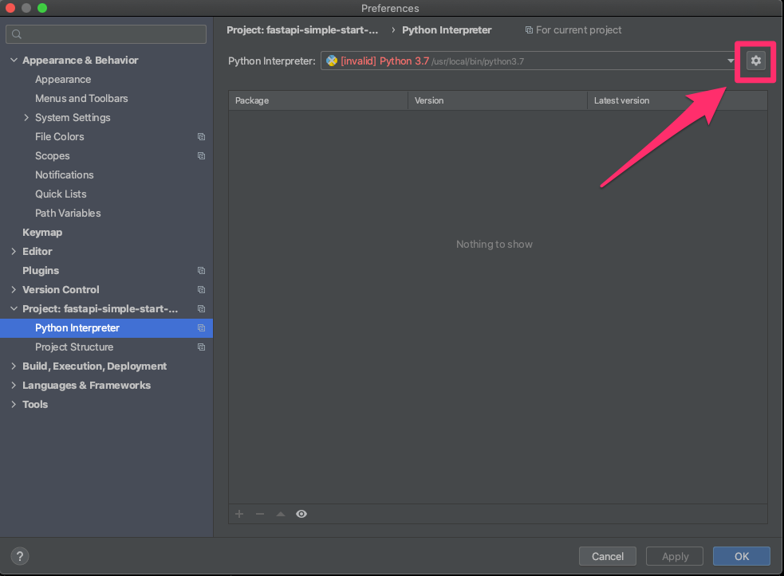

- `Docker Compose` を選んで画像のように入力して `OK`
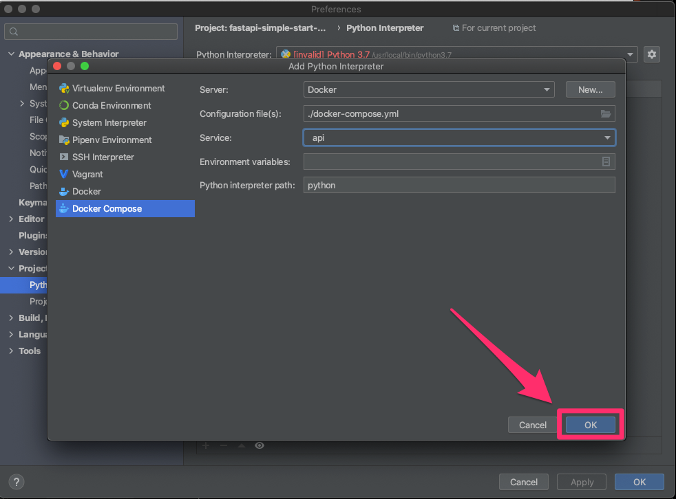

- フォルダのアイコンをクリックしてパスをマッピングする。
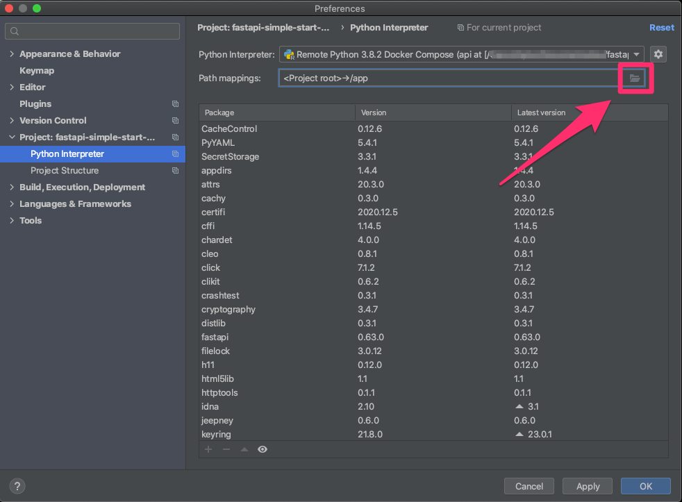

- `Local Path` にローカルのプロジェクトのパス、 `Remote Path` には Docker コンテナ内のコードを配置するパスを入力して `OK`
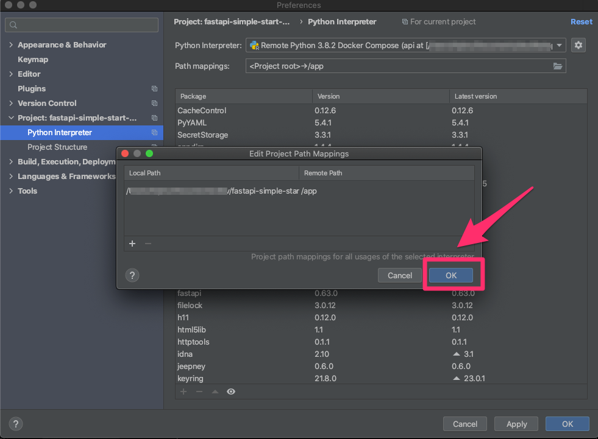

- `Apply` して `OK`
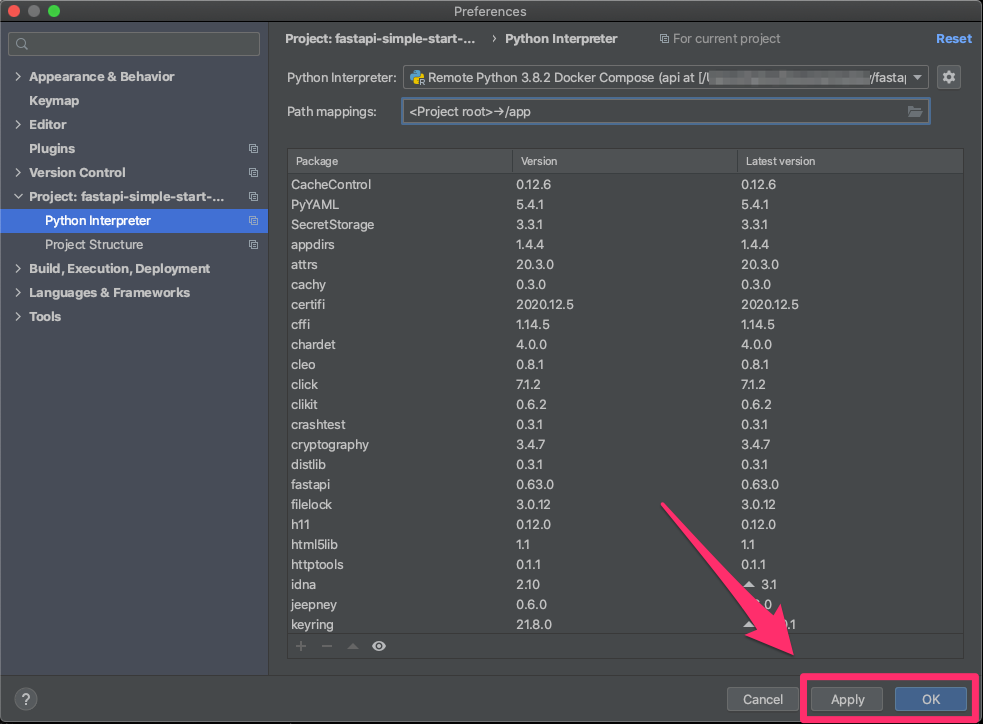

### デバッグ設定
- Run > Edit Configurations
- `+` をクリックして `Python` を選択
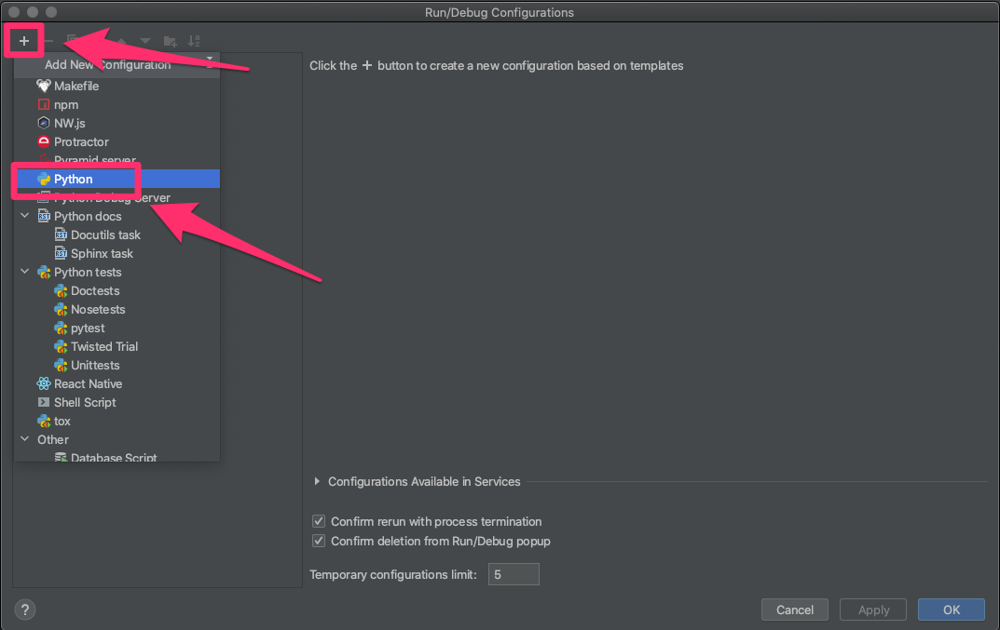

- 画像の内容で入力して `Apply` して `OK`
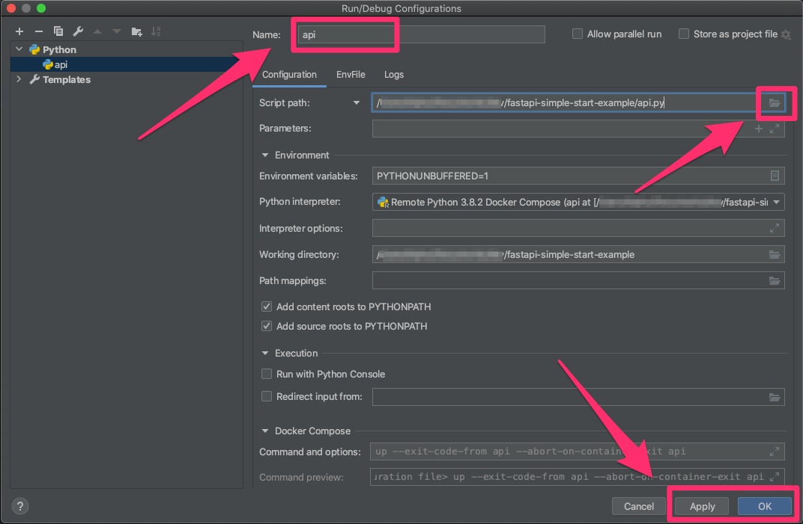
- `Name` に適当に名前を入力。今回は `api`。
- `Script path` にはローカルのエントリーポイントとなるファイルのパスを入力。
- `Working directory` はローカルのプロジェクトルートを入力。

### デバッグ実行
- ブレイクポイントを付ける。
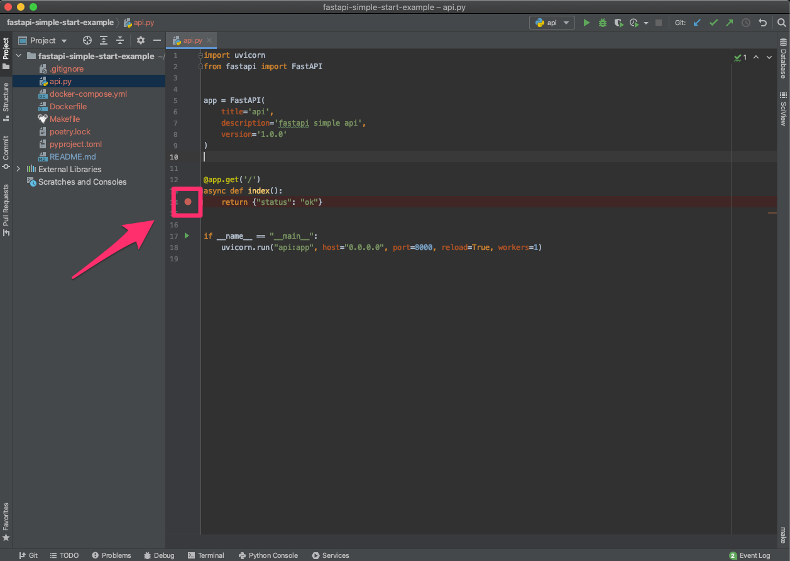

- 実行する対象に `api` を選択。
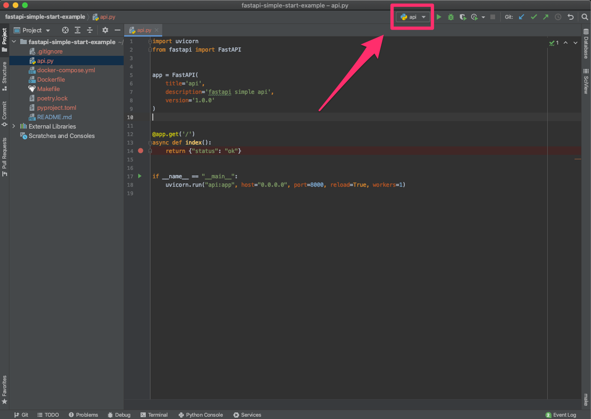

- デバッグアイコンをクリックすると、コンテナが起動する
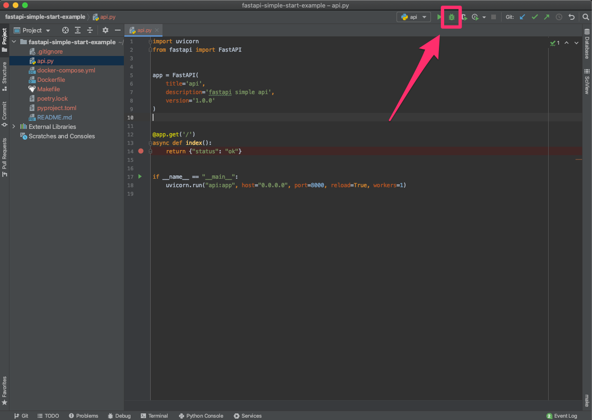

- `http://localhost:8000` で api を実行するとブレイクポイントで止まる。
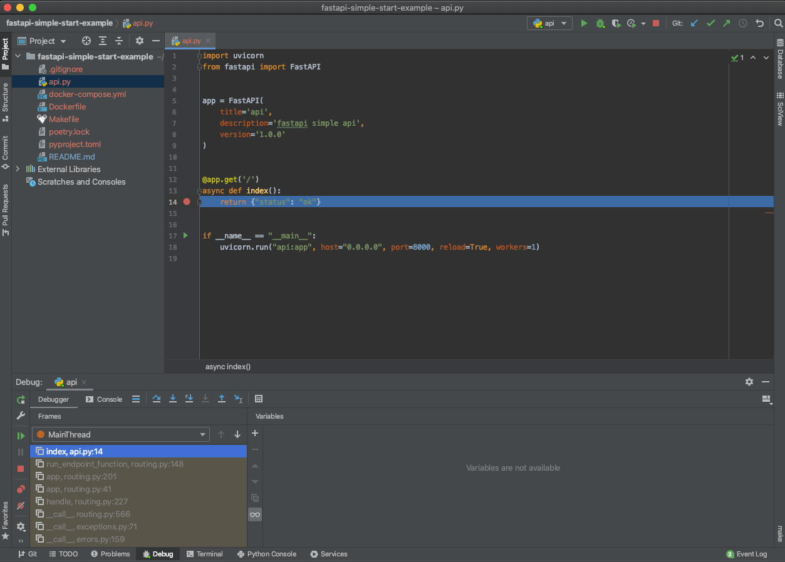
